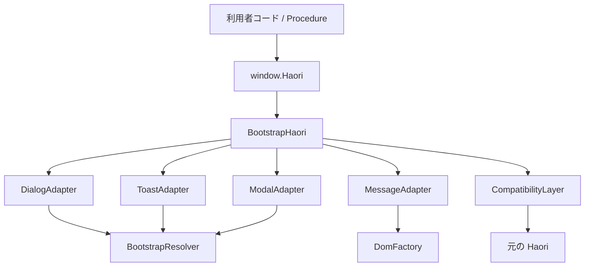

# Haori.js Bootstrap 初期設計書

## 1. 文書概要

### 1.1 目的

本書は、Haori.js の Bootstrap 向け拡張ライブラリである Haori.js Bootstrap の初期設計案を整理することを目的とする。現在は本設計を基にした実装とテストが存在するが、本書自体は README と利用者から与えられた前提、ならびに Haori.js の公開仕様として確認できている範囲を根拠に、初期設計時点の判断材料を残す。

### 1.2 対象範囲

- Haori の UI 系静的メソッドを Bootstrap ベースに差し替えるための設計方針
- ライブラリ利用者向けの公開 API 案
- モジュール責務、依存関係、統合方法、フォールバック方針
- 初期ディレクトリ構成、テスト観点、段階的実装プラン

### 1.3 非対象

- 実装コードの確定
- Haori.js 本体の内部実装仕様の断定
- Bootstrap の詳細見た目やテーマ設計の確定
- 長期的なビルドツール選定や将来バージョン互換方針の最終決定

### 1.4 根拠

- ユーザー提示の前提条件
- Haori.js 公開リポジトリ: https://github.com/meibinlab/haori-js
- Haori.js の公開仕様として提示された静的メソッド一覧
- Haori クラスを継承し、window.Haori へ再代入できるというガイド情報

### 1.5 命名方針

- 本書では、拡張ライブラリの正式名称を Haori.js Bootstrap とする。
- パッケージ名、import 識別子、ディレクトリ名のような機械可読な識別子は、必要に応じて haori-js-bootstrap を用いる。

## 2. 前提条件

### 2.1 確定前提

- Haori.js Bootstrap は Haori.js と併用される拡張ライブラリである。
- 利用者は Haori.js と haori-js-bootstrap を同一画面で読み込む。
- 読み込み後、Haori.dialog、Haori.confirm、Haori.toast、Haori.openDialog、Haori.closeDialog、Haori.addErrorMessage、Haori.clearMessages などの UI 系振る舞いを Bootstrap ベースに差し替える。
- Procedure は data-click-confirm、data-click-dialog、data-click-toast、data-click-open、data-click-close を通して Haori の静的メソッドを呼ぶ。
- Haori 本体は zero dependency を前提とし、本拡張側は Bootstrap の JS と CSS への依存を許容する。

### 2.2 設計上の前提

- Procedure 側は Haori の静的メソッド名に依存しているため、本拡張はメソッド名と戻り値契約をできるだけ維持する必要がある。
- Haori 本体を改変せず、グローバル置換と読み込み時自動有効化によって差し替える構成を優先する。
- Bootstrap 依存は UI アダプタ層に閉じ込め、将来の Bootstrap バージョン差し替えや非 Bootstrap 実装との差し替えに備える。

### 2.3 初期版で確定する実装前提

- 正式対応は Bootstrap 5.3 系に限定する。
- ブラウザ直読み込みでは、Bootstrap CSS と bootstrap.bundle.js を haori-js-bootstrap より先に読み込み、window.bootstrap が存在することを前提とする。
- ESM と IIFE を正式配布形式とし、どちらも読み込み時の自動有効化を基本導線とする。install は既定設定の上書きや再適用時の補助 API とする。
- dialog と toast の message はプレーンテキストとして扱い、HTML は許可しない。
- confirm の正式契約は Promise<boolean> とし、OK のみ true、それ以外は false に正規化する。
- addErrorMessage と clearMessages は、本ライブラリが生成した DOM のみを管理対象とする。
- dialog、confirm、toast のテンプレートはライブラリが自動生成し、リッチコンテンツが必要な場合は openDialog で利用者提供 DOM を表示する。

## 3. 目的と非目的

### 3.1 目的

- Haori の既存 Procedure 連携を壊さずに、UI の表示実装だけを Bootstrap ベースへ切り替える。
- 利用者が最小限の読み込みと初期化で導入できるようにする。
- Haori 本体の zero dependency 方針を壊さず、依存増加を拡張ライブラリ側に限定する。
- Bootstrap 非存在時や対象 DOM 不整合時に、壊れ方が分かりやすい構成にする。

### 3.2 非目的

- Haori の Procedure やイベントモデルの再設計
- フォームバリデーションや通信処理など UI 以外の Haori 機能の拡張
- Bootstrap コンポーネント全般のラッパー提供
- すべての UI コンポーネントに対する高度なテーマ API 提供

## 4. 想定ユースケース

### 4.1 基本導入

利用者は HTML 上で Haori.js、Bootstrap CSS/JS、haori-js-bootstrap を順に読み込む。Haori.js Bootstrap はグローバルの Haori を Bootstrap 対応実装へ差し替え、既存の data-click-* 属性を使った画面が Bootstrap 表示で動作する。

### 4.2 Procedure 経由の確認ダイアログ

削除ボタンなどに data-click-confirm を付与している既存画面で、Haori.confirm が Bootstrap Modal ベースの確認 UI を表示する。

### 4.3 プログラムからの通知表示

画面遷移後や Ajax 完了後に Haori.toast を直接呼び出し、Bootstrap Toast を使って通知表示を行う。

### 4.4 任意ダイアログ要素の開閉

既存画面内の dialog 相当要素やモーダル対象要素に対して Haori.openDialog と Haori.closeDialog を呼び出し、Bootstrap Modal として開閉する。

### 4.5 バリデーションメッセージ表示

フォームやセクション単位のエラー表示で、Haori.addErrorMessage と Haori.clearMessages を利用し、Bootstrap Alert または invalid-feedback 相当の見た目でメッセージを描画する。

## 5. アーキテクチャ方針

### 5.1 推奨方針

Haori の公開静的メソッド群を維持したまま、Bootstrap 依存実装を持つ派生クラスまたは差し替え用ファサードを提供する。UI の種類ごとにアダプタを分割し、最上位では BootstrapHaori だけが Haori 公開契約を意識する。

### 5.2 目標とする依存方向

- 利用者コード -> Haori または window.Haori
- BootstrapHaori -> UI アダプタ群
- UI アダプタ群 -> Bootstrap JS API と DOM API
- UI アダプタ群は Procedure や業務ロジックに依存しない

### 5.3 設計原則

- 公開面は最小化し、差し替えポイントを Haori の公開静的メソッドに揃える。
- Bootstrap 固有 API は内部モジュールへ隔離する。
- DOM 生成責務と Bootstrap インスタンス制御責務を分離する。
- フォールバック有無を設定可能にし、利用者が障害時の挙動を選べる余地を残す。

### 5.4 代替案と比較

| 案 | 内容 | 利点 | 懸念 |
| ---- | ---- | ---- | ---- |
| 推奨案 | Haori を継承した BootstrapHaori を提供し、window.Haori を差し替える | Haori ガイドと整合しやすく、Procedure 側に変更不要 | Haori 側の継承前提が崩れると追従が必要 |
| 代替案 | Haori を継承せず、同名静的メソッドを持つファサードを提供する | Haori 実装詳細への依存を減らせる | instanceof や継承前提の利用箇所がある場合に互換性リスク |

推奨案は、現時点で公開されている統合手段と整合し、既存 Procedure の利用継続を優先しやすいため採用候補とする。

## 6. 公開 API 案

### 6.1 基本方針

公開 API は、Haori の既存静的メソッド契約を維持するものと、導入制御のための最小限の補助 API に分ける。

### 6.2 差し替え対象 API

| API | 想定役割 | Bootstrap 対応案 | 備考 |
| ---- | ---- | ---- | ---- |
| dialog(message) | 情報表示ダイアログ | Modal を自動生成して表示 | Promise<void>。message は文字列を text として描画し、HTML は許可しない |
| confirm(message) | 確認ダイアログ | Modal 上の OK / Cancel | Promise<boolean>。OK のみ true、Cancel / Esc / backdrop click / 障害時は false |
| toast(message, level) | 通知表示 | Toast を自動生成して表示 | Promise<void>。level は info / warning / error を Bootstrap class へマッピング |
| openDialog(element) | 任意要素の表示 | 対象要素を Modal として開く | Promise<void>。element は HTMLElement 前提 |
| closeDialog(element) | 任意要素の非表示 | Modal を閉じる | Promise<void>。Bootstrap instance を再利用する |
| addErrorMessage(target, message) | エラー表示追加 | 所有コンテナへ feedback または alert を追加 | Promise<void>。target が form control なら直後、その他は先頭子要素へ描画 |
| clearMessages(parentOrTarget) | メッセージ削除 | 所有メッセージのみ削除 | Promise<void>。field target と container target の両方を受け付け、利用者が事前配置したメッセージは削除しない |

### 6.3 補助公開 API 案

| API | 目的 | 必須度 |
| ---- | ---- | ---- |
| install(options) | window.Haori の差し替え再実行と設定上書き | 中 |
| uninstall() | 元の Haori へ戻す。テストやホットリロード補助 | 中 |

### 6.4 options 案

| 項目 | 内容 | 状態 |
| ---- | ---- | ---- |
| bootstrap | Bootstrap 名前空間または依存注入対象。省略時は window.bootstrap を使用 | 確定 |
| fallbackToNative | Bootstrap JS 障害時に元の Haori 実装または native API へフォールバックするか。既定値 true | 確定 |
| toastContainerSelector | Toast 配置先。省略時は body 配下の専用コンテナを使用 | 確定 |
| dialogContainerSelector | Modal 挿入先。省略時は body を使用 | 確定 |

## 7. 主要クラス / モジュール構成案

### 7.1 推奨構成

| モジュール | 役割 |
| ---- | ---- |
| BootstrapHaori | Haori 互換の公開静的メソッドを提供する最上位ファサード |
| installBootstrapHaori | グローバル差し替えと自動有効化制御を担当 |
| DialogAdapter | dialog と confirm を担当 |
| ToastAdapter | toast を担当 |
| ModalAdapter | openDialog と closeDialog を担当 |
| MessageAdapter | addErrorMessage と clearMessages を担当 |
| BootstrapResolver | Bootstrap JS API の存在確認と取得 |
| DomFactory | 必要な DOM テンプレート生成とクリーンアップ |
| CompatibilityLayer | 元の Haori 実装への委譲やフォールバック制御 |

### 7.2 責務分割の意図

- BootstrapHaori は公開契約の維持に専念する。
- 各 Adapter は UI 種別単位の振る舞いだけを持つ。
- BootstrapResolver は Bootstrap 5.3 系 API の解決に限定する。
- CompatibilityLayer により、Bootstrap 未読込時の fallback、警告出力、元実装退避を一元化する。
- MessageAdapter は所有属性を付与し、clearMessages の削除対象を本ライブラリ生成 DOM に限定する。

### 7.3 モジュール間関係



## 8. 初期ファイル / ディレクトリ構成案

上流 Haori.js の構成に合わせ、初期実装は TypeScript を前提としたフラットな src、機能別 tests、用途別 demo、詳細文書用 docs を持つ構成を採用する。正式名称は Haori.js Bootstrap とし、ディレクトリ名は識別子として haori-js-bootstrap を用いる。現在のこのリポジトリでは初期設計書を doc/ 配下に置いているが、実装開始時の正式構成は docs/ へ寄せる前提で整理する。

### 8.1 構成整合方針

- 実装言語は JavaScript 最小構成ではなく、Haori.js と同様に TypeScript を前提とする。
- src は深い階層化を避け、機能単位のフラットなファイル群で責務を分割する。
- 公開入口は index、browser、install の 3 役に分け、ESM と IIFE の導線を明確に分離する。
- テストは test/unit や test/integration ではなく、tests 配下に機能別ファイルを並べる。
- examples は採用せず、上流と同様に demo 配下へ機能別サンプルを配置する。
- 詳細文書は README と役割分担し、docs/ja 配下へ集約できる構成を前提とする。
- Playwright によるブラウザ確認を後追いで追加しやすいよう、top-level に playwright を持てる構成とする。

```text
haori-js-bootstrap/
├─ README.md
├─ README.ja.md
├─ CHANGELOG.md
├─ package.json
├─ tsconfig.json
├─ vite.config.ts
├─ vitest.config.ts
├─ eslint.config.js
├─ src/
│  ├─ index.ts
│  ├─ browser.ts
│  ├─ install.ts
│  ├─ bootstrap_haori.ts
│  ├─ dialog.ts
│  ├─ toast.ts
│  ├─ modal.ts
│  ├─ message.ts
│  ├─ compatibility.ts
│  ├─ bootstrap_resolver.ts
│  ├─ dom_factory.ts
│  ├─ constants.ts
│  └─ types.ts
├─ tests/
│  ├─ install.test.ts
│  ├─ browser_auto_install.test.ts
│  ├─ dialog.test.ts
│  ├─ confirm.test.ts
│  ├─ toast.test.ts
│  ├─ modal.test.ts
│  ├─ message.test.ts
│  ├─ compatibility.test.ts
│  ├─ procedure_compatibility.test.ts
│  ├─ fallback.test.ts
│  └─ fixtures/
├─ demo/
│  ├─ index.html
│  ├─ vite.config.ts
│  ├─ dialog/
│  ├─ confirm/
│  ├─ toast/
│  ├─ modal/
│  ├─ message/
│  └─ procedure/
├─ docs/
│  └─ ja/
│     ├─ 導入ガイド.md
│     ├─ API.md
│     ├─ 構成方針.md
│     └─ Bootstrap連携仕様.md
└─ playwright/
```

### 8.2 補足

- README.md と README.ja.md は、利用方法、依存条件、サポート範囲、フォールバック方針を同期して記載する。
- src は初期段階ではフラット構成を維持し、ファイル数増加時のみ再分割を検討する。
- tests は機能別の契約確認を中心とし、単体と結合の違いはファイル内容で表現する。
- demo は Haori.js と Bootstrap の読み込み順、自動有効化、install による再設定、data-click-* 利用例の確認用とする。
- docs/ja は README で扱わない詳細仕様、導入ガイド、構成方針の格納先とする。
- 現在の doc/ 配下の初期設計書は設計フェーズ用の暫定配置とし、実装開始時に docs/ja へ移設して README の参照先も更新する。
- playwright はブラウザ実挙動の確認が必要になった段階で利用する。

### 8.3 上流 Haori.js への追従範囲

| 観点 | Haori.js に合わせる内容 | Haori.js Bootstrap での扱い |
| ---- | ---- | ---- |
| top-level ディレクトリ | src、tests、demo、docs/ja、playwright を持つ構成 | 同じ top-level 構成を目標とする |
| 設定ファイル | package.json、tsconfig.json、vite.config.ts、vitest.config.ts、eslint.config.js | 同名ファイルを採用し、開発導線を揃える |
| src の整理単位 | 深い階層より機能別ファイルを優先 | フラットな src を基本とし、必要時のみ再分割する |
| tests の整理単位 | tests 配下に機能別テストを配置 | UI 契約、Procedure 互換、フォールバックを機能別ファイルで検証する |
| demo の位置付け | top-level の demo で利用例と確認導線を持つ | dialog、toast、message、procedure などの機能別デモを配置する |
| docs の位置付け | README と docs/ja を分離する | README は概要、docs/ja は詳細仕様の正本とし、導入ガイド、API、構成方針、Bootstrap 連携仕様を分割配置する |
| Playwright 関連ファイル | playwright/ と top-level の Playwright 設定を持つ | playwright/ と top-level の Playwright 設定ファイルを採用し、シナリオ内容だけを UI 拡張向けに差し替える |
| 配布物の入口 | npm 用入口とブラウザ用入口を分けて公開する | npm 用は ESM、ブラウザ用は IIFE とし、exports と dist の責務を分離する |
| 意図的に変える点 | UI 拡張を持たない core library | Bootstrap 依存の UI 拡張を持つため、dialog、toast、message など UI 専用モジュールを追加する |

### 8.4 初期配布構成

初期版では、配布物を次の 3 ファイルへ絞る。

```text
dist/
├─ haori-js-bootstrap.js
├─ haori-js-bootstrap.iife.js
└─ index.d.ts
```

- src/index.ts を単一の build entry とし、Vite の library mode で ESM と IIFE を同時生成する。
- npm 公開面は root entry のみとし、package.json の exports は `.` と `./package.json` に限定する。
- `main`、`module`、`types` はそれぞれ `./dist/haori-js-bootstrap.js`、`./dist/haori-js-bootstrap.js`、`./dist/index.d.ts` を指す。
- `files` は `dist` のみを公開対象とする。
- IIFE 版の `window.HaoriBootstrap` は、Vite の library build が生成するグローバル公開面を利用する。

### 8.5 最初に作る実装ひな形

初期実装では、設計上の完全構成を一度に作らず、次の最小構成から開始する。

```text
package.json
tsconfig.json
vite.config.ts
vitest.config.ts
eslint.config.js
src/index.ts
src/browser.ts
src/install.ts
src/bootstrap_haori.ts
src/types.ts
tests/install.test.ts
tests/browser_auto_install.test.ts
demo/index.html
demo/main.ts
demo/vite.config.ts
```

- dialog、toast、modal、message の個別モジュール分割は、install と自動有効化の骨格が安定した後に着手する。
- 最初のテストは install、uninstall、自動有効化の契約に限定し、UI の詳細描画は次段階で追加する。

## 9. Haori 本体との統合方法

### 9.1 推奨統合方法

初期版は、利用形態ごとに統合方法を明確に分ける。

1. ブラウザ直読み込みでは、利用者が Haori.js 本体、Bootstrap CSS、bootstrap.bundle.js、haori-js-bootstrap の順に読み込む。
2. IIFE 版は読み込み時に prerequisites を確認し、window.Haori と window.bootstrap が存在する場合のみ自動で有効化する。
3. ESM 版も import 時に prerequisites を確認し、window.Haori と window.bootstrap が存在する場合は自動で有効化する。
4. install は自動有効化後にも呼び出せるものとし、既定設定の上書きや再適用を担当する。
5. uninstall は退避済みの元実装を復元する。

### 9.2 ESM の統合例

```js
import 'haori-js-bootstrap';
```

既定設定を上書きしたい場合は、読み込み後に install を追加で呼び出す。

```js
import { install } from 'haori-js-bootstrap';

install({
  fallbackToNative: true,
});
```

### 9.3 自動有効化と install の扱い

- IIFE 版は、利用者の期待どおり「Haori と一緒に読み込むと差し替わる」体験を実現するため、読み込み時自動有効化を正式採用する。
- ESM 版も、install を書かなくても有効化される体験を優先し、import 時自動有効化を正式採用する。
- ただし prerequisites が不足している場合はページ全体を停止させず、console.warn を出して自動有効化を見送る。
- install は自動有効化を置き換える主導線ではなく、fallbackToNative などの既定設定を上書きしたい場合の補助 API とする。
- IIFE 版では window.HaoriBootstrap.install と window.HaoriBootstrap.uninstall を補助導線として公開してもよいが、README では補助用途であることを明記する。

### 9.4 統合時の互換性要件

- Procedure が参照する静的メソッド名を変更しない。
- 既存の window.Haori 呼び出しコードが破綻しないことを優先する。
- 元の Haori 実装へ戻せる手段を保持する。

## 10. 依存関係方針

### 10.1 基本方針

- 必須依存は Bootstrap のみを基本とする。
- Haori は peer 相当の前提依存とし、本ライブラリへ同梱しない。
- DOM ヘルパーや UI 補助のための追加依存は、初期版では原則導入しない。

### 10.2 Bootstrap の扱い

- 正式対応は Bootstrap 5.3 系に限定する。
- Bootstrap CSS は利用者側で読み込む前提とする。
- Bootstrap JS は bootstrap.bundle.js を利用者側で読み込む前提とし、本ライブラリは window.bootstrap の存在確認のみを行う。
- Bootstrap 5.4 以降と 5.2 以前は初期版の互換保証対象外とし、Resolver で吸収しない。
- Bootstrap を npm dependency として内包する案は、バージョン衝突や二重読込リスクがあるため、初期案では採用しない。

### 10.3 ライセンス方針

- 感染性ライセンスや有償依存は採用しない。
- 追加依存が必要な場合は、必要性、影響範囲、ライセンス条件を個別評価する。

## 11. エラーハンドリング / 互換性 / フォールバック方針

### 11.1 エラーハンドリング方針

- install は window.Haori が存在しない場合にのみ Error を投げて失敗させる。
- 自動有効化時はページ停止を避けるため、prerequisites 不足を console.warn で通知し、自動有効化を見送る。
- 実行時 API は confirm を除き、運用上の失敗を原則として外へ throw せず、フォールバックまたは no-op に正規化する。
- confirm は OK 操作のみ true を返し、Cancel、Esc、backdrop click、閉じるボタン、Bootstrap 障害時はすべて false に正規化する。
- dialog と toast の message は常に textContent 相当で描画し、innerHTML は使用しない。

### 11.2 互換性方針

- 既存の Haori 呼び出し側から見た API 名、主要引数、基本責務を維持する。
- 戻り値契約は、dialog、toast、openDialog、closeDialog、addErrorMessage、clearMessages を Promise<void>、confirm を Promise<boolean> に固定する。
- Bootstrap 依存部分は BootstrapResolver へ閉じ込め、初期版では Bootstrap 5.3 系 API のみを対象にする。

### 11.3 フォールバック方針

- fallbackToNative の既定値は true とする。
- 適用対象は Bootstrap JS に依存する dialog、confirm、toast、openDialog、closeDialog に限定する。
- addErrorMessage と clearMessages は Bootstrap JS 非依存の自前 DOM 管理で完結させ、fallbackToNative の対象外とする。

| API | fallbackToNative=true の挙動 | fallbackToNative=false の挙動 |
| ---- | ---- | ---- |
| dialog | 元の Haori.dialog へ委譲し、元実装がなければ window.alert を使用して Promise<void> に正規化する | console.warn を出して no-op |
| confirm | 元の Haori.confirm へ委譲し、元実装がなければ window.confirm を使用して Promise<boolean> に正規化する | console.warn を出して false を返す |
| toast | 元の Haori.toast へ委譲し、元実装がなければ console.warn を出して no-op | console.warn を出して no-op |
| openDialog | 元の Haori.openDialog へ委譲し、元実装がなければ console.warn を出して no-op | console.warn を出して no-op |
| closeDialog | 元の Haori.closeDialog へ委譲し、元実装がなければ console.warn を出して no-op | console.warn を出して no-op |

### 11.4 メッセージ DOM 所有権

- 本ライブラリが生成したメッセージノードと状態クラスだけを管理対象とし、専用の data 属性で所有権を示す。
- addErrorMessage は target ごとに 1 つの所有コンテナを再利用し、同一 target に対して不要なノード増殖を防ぐ。
- target が input、select、textarea の場合は invalid-feedback 互換の所有コンテナを生成し、対象 control へ所有印付きの is-invalid 状態を付与する。
- ただし target が checkbox または radio の場合は、target 直後ではなく、最寄りの form-check 要素の末尾へ所有コンテナを追加する。
- target がそれ以外の HTMLElement の場合は、target の先頭に alert-danger 互換の所有コンテナを生成する。
- clearMessages は HTMLElement を受け取り、その要素配下の所有コンテナ、所有メッセージ、所有印付き状態クラスのみを削除する。
- 引数自身が input、select、textarea の場合は、配下探索に加えて、その control 直後の所有コンテナと所有印付き状態クラスも削除対象に含める。
- 利用者が事前に配置した alert、invalid-feedback、説明文、サーバー描画済みメッセージは削除しない。

### 11.5 clearMessages の利用契約

- フィールド単位でエラーを消したい場合は、その input、select、textarea 自身を clearMessages に渡してよい。
- フォームやセクション単位で消したい場合は、form、fieldset、section などの親要素を渡す。
- MessageAdapter は、field target と container target のどちらが渡されても同じ所有ノードを二重削除しない実装とする。

### 11.6 ログ方針案

- 初期版では console.warn と console.error に限定する。
- 本番運用向けのロガー注入は必要性が確認できた時点で検討する。

## 12. テスト観点

### 12.1 契約テスト

- confirm が Promise<boolean> を返し、OK のみ true、Cancel / Esc / backdrop click / 障害時が false であること
- dialog と toast が HTML 文字列を text として描画し、innerHTML を使わないこと
- IIFE 版が prerequisites 充足時のみ読み込み時自動有効化し、不足時は警告のみで停止しないこと
- ESM 版が import 時に自動有効化し、install 呼び出しで設定上書きできること
- install と uninstall が元の Haori 実装を正しく退避、復元し、複数回呼び出しでも破綻しないこと
- clearMessages が field target と container target の両方で所有ノードだけを削除できること

### 12.2 単体テスト

- BootstrapHaori の各静的メソッドが対応 Adapter を正しく呼ぶこと
- BootstrapResolver が Bootstrap API の有無を正しく判定すること
- CompatibilityLayer が元実装退避、委譲、復元を正しく行うこと
- level と Bootstrap class のマッピングが意図どおりであること

### 12.3 結合テスト

- Haori.js と haori-js-bootstrap を読み込んだ状態で data-click-confirm などが Bootstrap UI に接続されること
- openDialog と closeDialog が既存 DOM 要素に対して動作すること
- addErrorMessage と clearMessages が対象 DOM 内だけに作用すること
- Bootstrap 未読込時のフォールバックまたはエラーが設計どおりであること

### 12.4 ブラウザ確認観点

- Modal が連続操作でも二重生成されないこと
- Toast が複数件連続表示で破綻しないこと
- メッセージ削除が他の静的メッセージを巻き込まないこと
- 利用者が独自に配置した Bootstrap コンテナと競合しないこと

### 12.5 回帰観点

- Procedure から参照される data-click-* 経路が従来どおり利用できること
- window.Haori のグローバル差し替え後も既存呼び出しコードの import 方式と競合しないこと
- Bootstrap 5.3 系の範囲内で Resolver だけに依存差異を閉じ込められること

## 13. 未決事項

| 項目 | 内容 | 影響 |
| ---- | ---- | ---- |
| メッセージ UI の詳細 class | invalid-feedback と alert-danger の細かな class 構成や spacing をどう標準化するか | 実装詳細と見た目に影響 |
| Toast のキュー制御 | 同時表示数、積み上げ方向、自動消去秒数の細かな既定値 | UX と demo に影響 |
| TypeScript 設定の厳格度 | strict、declaration、公開型定義の粒度をどこまで初期版で固定するか | 開発体験と公開 API ドキュメントに影響 |
| 配布物と exports の構成 | dist の成果物名、exports の切り方、browser 用入口と npm 用入口の対応をどう固定するか | README の利用例と実際の公開物に影響 |
| サポートブラウザ | Bootstrap 5.3 系の前提をどこまで README と docs/ja で明示するか | テスト範囲と公開条件に影響 |

## 14. 段階的実装プラン案

1. IIFE と ESM の自動有効化、CompatibilityLayer、dialog / confirm / toast の 3 API を実装し、Procedure 連携の基本経路を確認する。
2. openDialog、closeDialog、addErrorMessage、clearMessages を追加し、所有 DOM 契約と削除範囲をテストで固定する。
3. browser.ts、demo、docs/ja、README.md、README.ja.md、契約テストを整備し、Bootstrap 5.3 系前提で公開前検証を行う。
